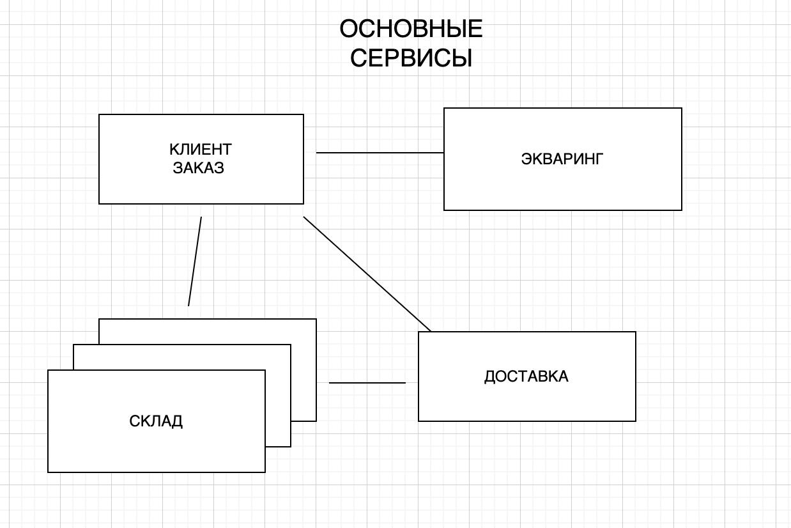
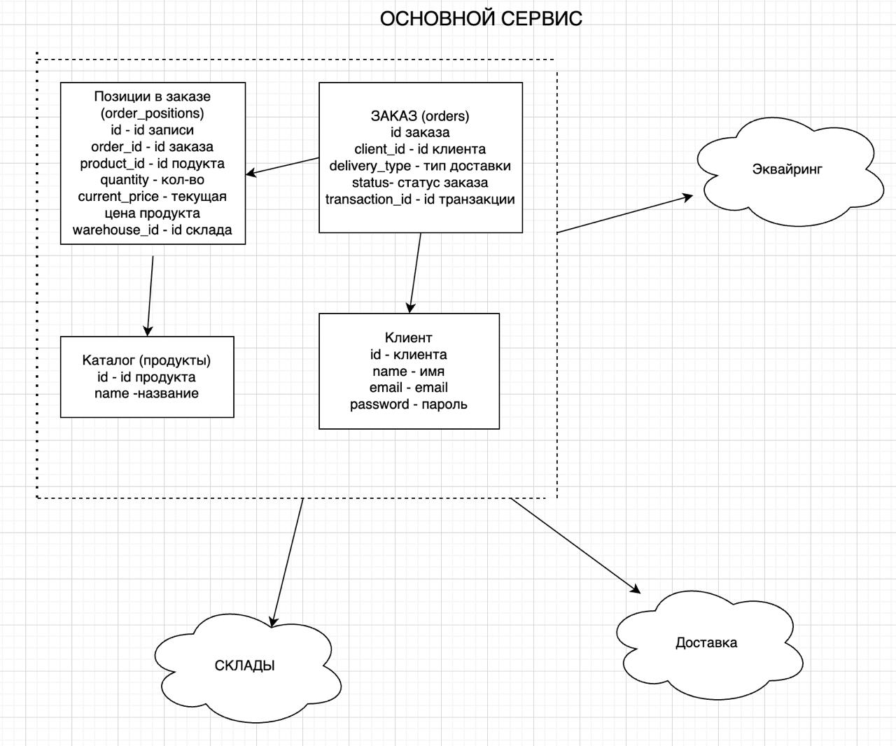
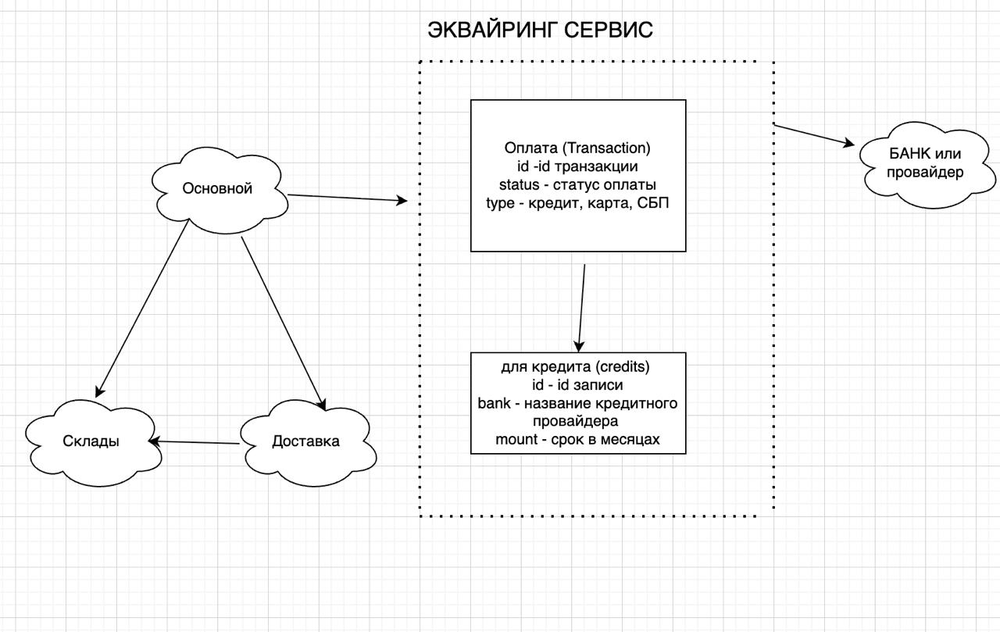
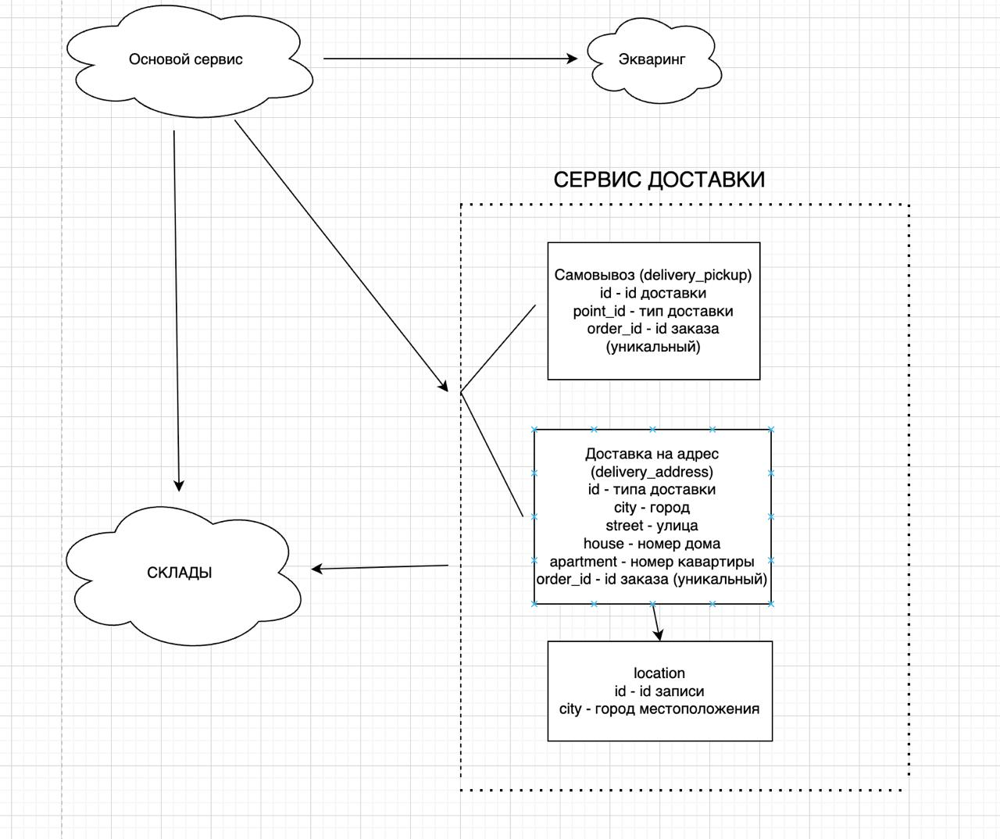

## Критические бизнес-процессы и отказоустойчивость

Для обеспечения непрерывности бизнеса и удержания пользователей в системе реализованы механизмы обработки внештатных ситуаций:

1. **Отказоустойчивость при оформлении:**
    * При недоступности CRM/Склада сайт обязан принять заказ в режиме «оффлайн», даже если статус наличия товара неизвестен.
    * После восстановления связи система автоматически синхронизирует и передает накопленные заказы в CRM.

2. **Работа с логистическими сбоями:**
    * При недоступности сервиса службы доставки пользователь видит последнее закешированное местоположение заказа.
    * При восстановлении коннекта клиент получает актуальное уведомление о текущем статусе.

3. **Обработка дефицита и компенсация:**
    * В случае невозможности отгрузки со склада и невозможности производства товара, система запускает сценарий лояльности: уведомление клиента -> полный возврат средств -> начисление бонусных баллов в качестве извинения.

# ОСНОВНАЯ СХЕМА 
##  Визуальная схема сервисов

Система спроектирована как созвездие микросервисов, где каждый модуль выполняет строго определенную функцию. Центральное звено — сервис **Заказ**, который координирует потоки данных.

| Сервис | Роль в системе | Особенности взаимодействия |
| :--- | :--- | :--- |
| **Клиент / Заказ** | Центральный оркестратор (ОТС). Хранит бизнес-логику и управляет статусами. | При оформлении метит каждую позицию `warehouse_id`, определяя источник отгрузки. |
| **Склад (Multi-warehouse)** | Распределенная система хранения. Контролирует резервы и наличие на конкретных точках. | Получает команду на бронь от Заказа. Связан напрямую с доставкой для подготовки груза. |
| **Эквайринг** | Финансовый модуль. Обработка карт и заявок на кредит. | Асинхронно подтверждает оплату, переводя заказ в статус «Готов к сборке». |
| **Доставка** | Логистический хаб. Расчет маршрутов и управление курьерами. | **Напрямую взаимодействует со Складом**, используя `warehouse_id` для забора товара из верной точки. |

---

### Схема связей 

1. **Клиент** выбирает товар -> **Заказ** опрашивает **Склады** на наличие.
2. **Заказ** фиксирует ID конкретного склада за товаром -> Отправляет запрос на оплату в **Эквайринг**.
3. **Эквайринг** подтверждает платеж -> **Заказ** дает команду **Складу** начать сборку.
4. **Доставка** получает данные о заказе и **складе отгрузки** -> Строит маршрут и уведомляет клиента.

# СХЕМА ОСНОВНОГО СЕРВИСА

Архитектура системы объединяет реляционную структуру хранения и микросервисный подход к внешним интеграциям.

### 1. Ядро системы (Основной сервис)
Центральный узел инкапсулирует в себе четыре ключевые сущности:
*   **Заказ (`orders`)**: Головная таблица, управляющая статусом и связями.
*   **Позиции заказа (`order_positions`)**: Детализированный состав. Именно здесь реализуется **Sourcing** через поле `warehouse_id`.
*   **Клиент**: Профили пользователей и данные для авторизации.
*   **Каталог**: Справочник продуктов, связанный с позициями заказа.

##  Интеграция с финансовыми провайдерами

Сервис оплаты выступает в роли изолированного шлюза (Gateway), обеспечивая безопасный обмен данными между внутренними системами и внешними финансовыми институтами.

### Взаимодействие с внешними провайдерами

| Сторона | Описание интеграции |
| :--- | :--- |
| **Банк / Провайдер** | Внешняя система, принимающая запросы на проведение транзакций или одобрение кредитных линий. |
| **Сервис Оплаты** | Инкапсулирует логику транзакции. При выборе кредита формирует запись в `credits` и инициирует сессию с конкретным банком. |

## 🚚 Сервис доставки и гео-позиционирования

Сервис доставки инкапсулирует логику распределения заказов и управления точками выдачи, обеспечивая гибкость между курьерской доставкой и самовывозом.

### 1. Структура логистических данных
Реализована модель с разделением зон ответственности:
*   **Самовывоз (`delivery_pickup`)**: Фиксирует `point_id` конкретного пункта выдачи.
*   **Доставка на адрес (`delivery_address`)**: Хранит детальные реквизиты (улица, дом, квартира).
*   **Гео-справочник (`location`)**: Служит единым реестром городов (`city`), предотвращая дублирование и ошибки при вводе адреса.

### 2. Архитектурные особенности

| Параметр | Описание реализации |
| :--- | :--- |
| **Связь 1:1** | Использование `order_id` в качестве уникального ключа в таблицах доставки гарантирует, что у заказа может быть только один метод получения. |
| **Нормализация** | Таблица `location` позволяет централизованно управлять списком городов для всех типов доставки. |
| **Интеграция** | Сервис получает данные от **Основного сервиса** и координирует забор товара со **Складов**. |

# Функциональные требования

## Бизнес-цели проекта

| Цель | Описание |
| :--- | :--- |
| **Автономия клиента** | Предоставление возможности самостоятельного формирования заказа на покупку мебели без участия персонала. |
| **Прозрачность склада** | Реализация актуального отображения наличия позиций на складе в режиме реального времени при оформлении через сайт. |
| **Оптимизация ресурсов** | Снижение нагрузки на операционный отдел и минимизация участия менеджера за счет автоматизации обработки заказов. |
| **Лояльность и удержание** | Создание личного кабинета пользователя с историей заказов и функционалом быстрого повтора завершенных покупок. |

## Функциональные требования

| Модуль | Описание требования |
| :--- | :--- |
| **Управление доступом** | Реализация гибридной авторизации: поддержка собственной базы данных пользователей и интеграция с внешними сервисами (OAuth/Social Login). |
| **Автоматизация процессов** | Автоматическое уведомление складских систем о новых заказах и триггерная смена статусов заказа на каждом этапе обработки. |
| **Финансовый модуль** | Полная интеграция с платежными шлюзами (эквайринг) для обеспечения различных методов оплаты (карты, СБП, кредит). |
| **Логистический модуль** | Взаимодействие с API служб доставки для динамического расчета стоимости, сроков и отслеживания отправлений. |
| **Информирование** | Проактивное уведомление клиента о статусе заказа (сборка, передача в доставку, прибытие) через доступные каналы связи. |
| **Пользовательский опыт** | Возможность повтора завершенного заказа в один клик и обязательное подтверждение операций через личный кабинет. |

---

## Требования к UX (User Experience)

| Категория | Принцип реализации |
| :--- | :--- |
| **Интуитивность** | Интерфейс должен быть понятен без инструкций. Логика взаимодействия исключает двусмысленность и ошибки пользователя. |
| **Гибкость** | Предоставление пользователю контроля: выбор удобных временных слотов, типов доставки и предпочтительных способов оплаты. |

---

## Технологические зависимости и интеграции

| Зависимость | Назначение |
| :--- | :--- |
| **Payment Gateways** | Внешние сервисы эквайринга для безопасной обработки платежей. |
| **Logistics API** | Внешние интерфейсы курьерских служб для управления доставкой. |
| **Notification Service** | Внутренний или внешний сервис для рассылки Email/SMS/Push-уведомлений. |
| **IAM System** | Система управления идентификацией и доступом (Identity and Access Management). |
| **Internal Protocols** | Единый регламентированный протокол взаимодействия между всеми подсистемами. |

---

## ️ Ограничения проекта

| Тип ограничения | Описание |
| :--- | :--- |
| **Бюджет** | Лимиты финансирования, напрямую влияющие на выбор сторонних сервисов и глубину разработки. |
| **Ресурсы** | Ограниченность человеческого ресурса и фиксированные сроки вывода продукта на рынок (Time-to-Market). |
| **Внешняя среда** | Зависимость от SLA и стабильности API сторонних провайдеров (банки, логистика, авторизация). |
| **География** | Необходимость корректной работы с часовыми поясами при расчете логистики и отправке уведомлений. |

# Не функциональные требования

## Системные спецификации (Сайт)

Правила работы клиентской части приложения для обеспечения производительности и безопасности.

| Требование | Описание и обоснование |
| :--- | :--- |
| **Пагинация каталога** | Лимит — 10 элементов на страницу. Обеспечивает оптимальную нагрузку на БД и лучшее восприятие контента пользователем. |
| **Синхронизация стоков** | Обновление данных о наличии товара каждые 5 минут. Гарантирует клиенту достоверную информацию о доступности. |
| **SMS-авторизация** | Обязательное подтверждение через номер телефона. Повышает безопасность и упрощает вход для большинства пользователей. |
| **Условие отгрузки** | Заказ передается в исполнение только после фиксации 100% оплаты (защита бизнес-логики). |
| **Трекинг заказа** | Статус заказа должен обновляться в системе не реже одного раза в сутки для информирования клиента. |

---

## Производство и Склад

Логика взаимодействия с товарными запасами и производственными мощностями.

### Производственный блок

| Требование | Описание |
| :--- | :--- |
| **Прозрачность цикла** | Автоматическая передача данных о количестве товара, находящегося в процессе производства, для корректного планирования. |

### Складской учет

| Требование | Описание |
| :--- | :--- |
| **Интеграция с CRM** | Своевременное оповещение CRM-системы о фактическом наличии товара на полках. |
| **Резервирование** | Экземпляр товара в заказе автоматически бронируется и исключается из общего доступного остатка. |
| **Лимит брони** | Срок хранения неоплаченного резерва — максимум 3 дня (настраиваемый параметр системы). |

---

## Служба доставки

Регламенты логистического модуля для обеспечения качественного сервиса.

| Требование | Описание |
| :--- | :--- |
| **Статусы доставки** | Обновление информации о местонахождении груза не реже одного раза в 24 часа. |
| **Гибкость получения** | Реализация функционала выбора конкретного временного слота и места доставки по предпочтению клиента. |
